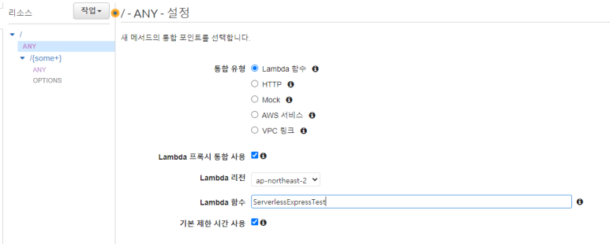

# aws-lambda-express-template

Express를 AWS Lambda로 사용하기 위한 가이드 및 템플릿입니다.

## 사전 준비물

-   AWS Lambda
-   테스트를 위한 SAM CLI: https://aws.amazon.com/ko/serverless/sam/
-   테스트를 위한 Docker (SAM 로컬 테스트에 필요)
-   배포를 위한 AWS CLI: https://docs.aws.amazon.com/ko_kr/cli/latest/userguide/install-cliv2.html

##

## Lambda 설정

### 1. Lambda 게이트웨이 설정

-   일반적인 HTTP 서버의 형태로 접근할 수 있게 게이트웨이를 추가해 경로를 설정해준다.

-   기존의 리소스는 삭제하고, "/"와 "/{some+}" 경로의 리소스를 추가한다. METHOD는 ANY, 통합 유형은 Lambda 함수 프록시로 한다.



### 2. 핸들러 설정

-   런타임 설정에서 핸들러 값을 `src/index.handler`로 변경

##

## 연동 및 테스트

### 1. Express 소스 연동

-   Express 소스 연동은 어려울 것이 없다. 기존의 프로젝트 디렉토리를 express 디렉토리에 위치시키면 된다. 그리고 index.js 핸들러 소스에서 export한 서버 객체를 받아 사용한다.

### 2. 로컬 서버 실행

-   루트 디렉토리에서 의존성을 설치하고, Express 프로젝트 디렉토리에서 의존성을 설치한 후, OS에 따라 `start.sh`(Linux)나 `start.cmd`(Windows)를 실행한다.

##

## 배포

### 1. AWS CLI 로그인

-   액세스 키와 시크릿 키를 사용해 로그인한다. (없다면 LAM 콘솔에서 사용자를 추가해 발급)

```
aws configure
```

### 배포

-   OS에 따라 `deploy.sh`(Linux)나 `deploy.cmd`(Windows)를 실행한다.
-   처음 실행하기 전에 해당 커맨드 파일을 열어서, `express_test`을 배포할 Lambda 함수명으로 치환한다.

##

## 레이어

### 1. 모듈 관리

-   모듈은 가급적 node_modules를 직접 올리지 않고, Layer로 업로드해 연동하는 방식을 취한다.
-   Layer는 node_modules가 포함된 파일을 압축률 없이 압축해 업로드하면 된다.
